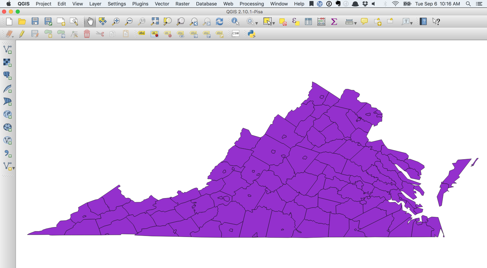
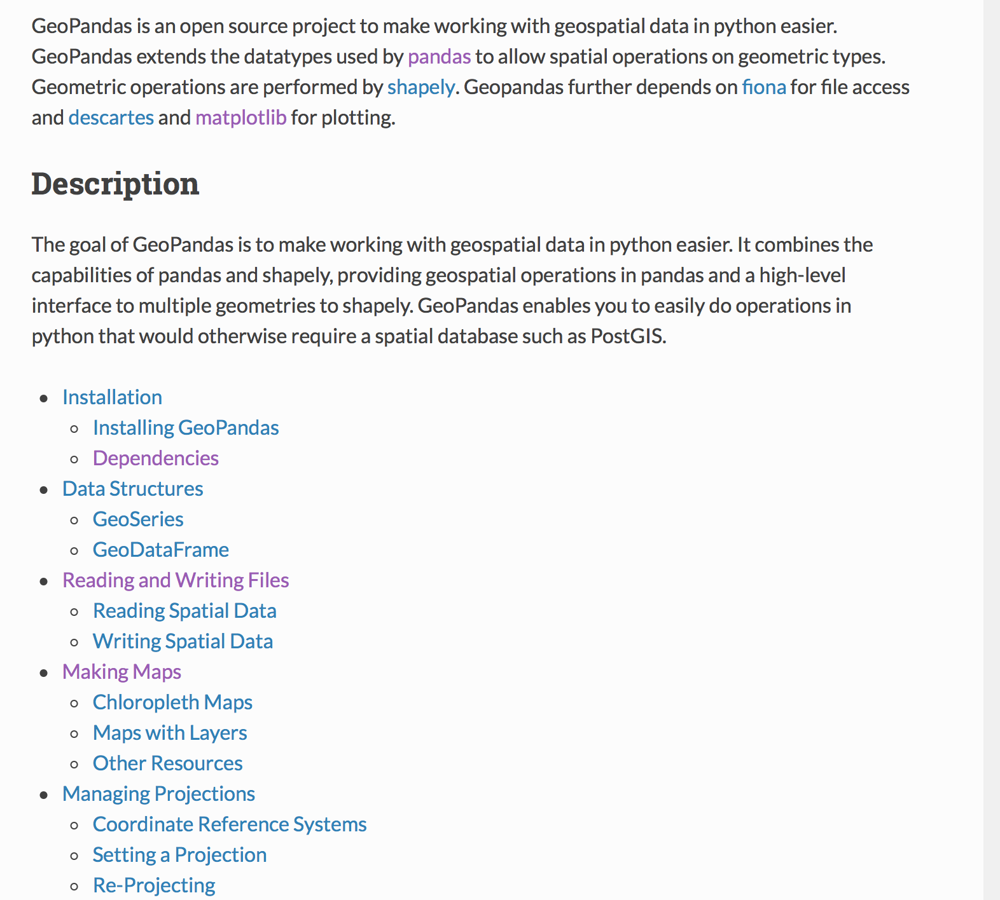
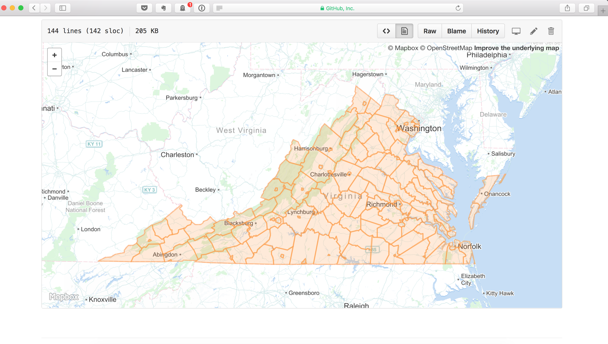
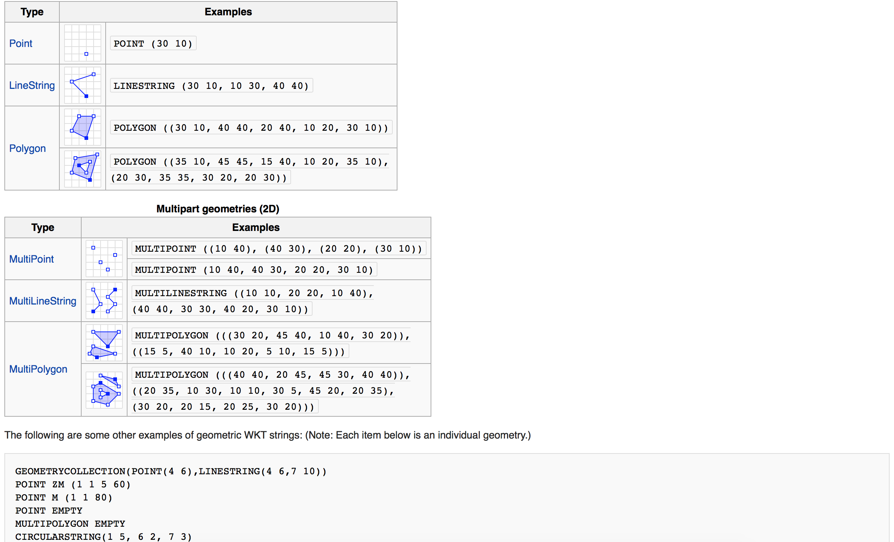
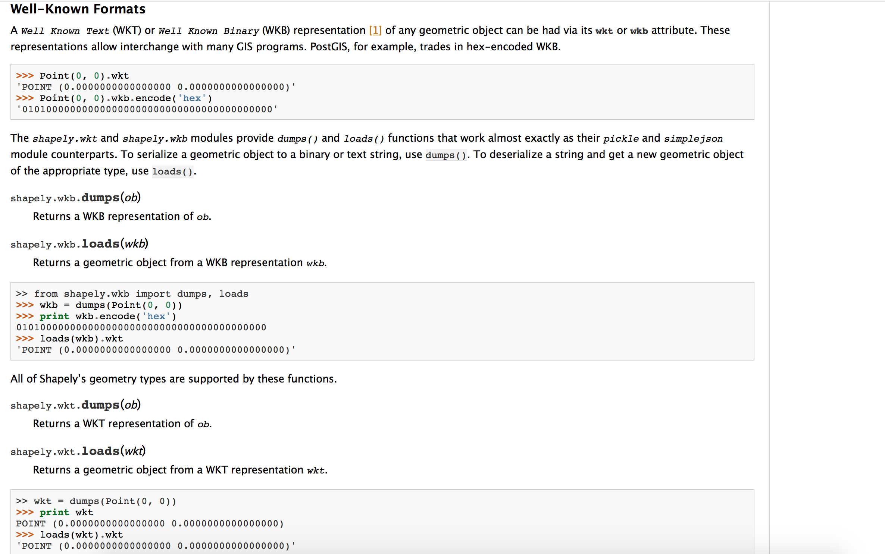
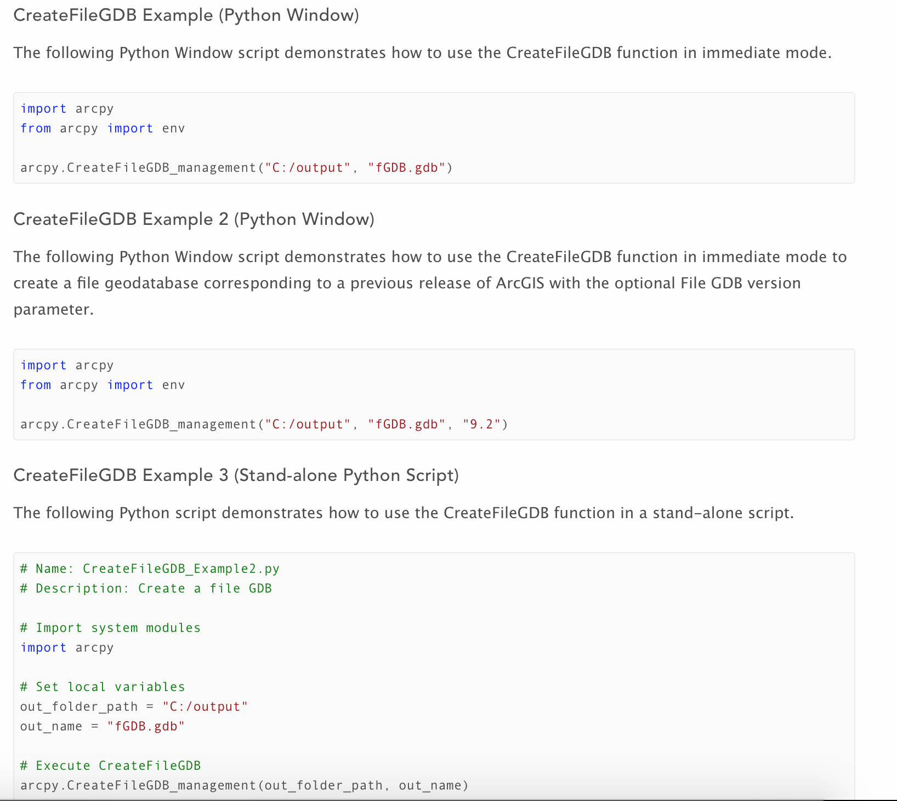
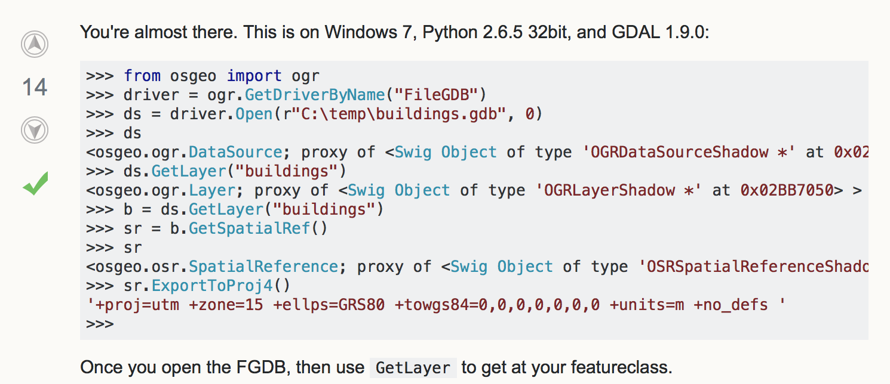

# Spatial Data Formats

Without spatial data there will not be much to visualize. Thus an important early step for your projects will be to acquire spatial data and be able to read and process the information as input into your visualization.

There is a rich diversion of spatial data types, as well as a growing number of Python libraries available for handling these data types. In this session we present an overview of the most commonly encountered spatial data formats and introduce a number of relevant packages for each type.

The emphasis is on vector formats. We will touch on raster formats in the hands-on session later in the week.

---

## Overview of Python Libraries to Handle Geospatial Data


[http://carsonfarmer.com/2013/07/essential-python-geo-libraries/](http://carsonfarmer.com/2013/07/essential-python-geo-libraries/)

---
## Vector Formats


### Shapefiles




#### arcpy


Source: http://pro.arcgis.com/en/pro-app/arcpy/get-started/what-is-arcpy-.htm

```
import arcpy

fc = "D:/st_johns/roads.shp"

# Create a search cursor 
#
rows = arcpy.SearchCursor(fc) 

# Create a list of string fields
fields = arcpy.ListFields(fc, "", "String")

for row in rows:
    for field in fields:
        if field.type != "Geometry":
            print "%s: Value = %s" % (field.name, row.getValue(field.name))
```

Source: http://help.arcgis.com/en/arcgisdesktop/10.0/help/index.html#/Accessing_data_using_cursors/002z0000001q000000/


---


[Is it possible to look at the contents of Shapefile using Python without an ArcMap license?](http://gis.stackexchange.com/questions/145015/is-it-possible-to-look-at-the-contents-of-shapefile-using-python-without-an-arcm/145029)


---

#### pysal


Source: http://pysal.readthedocs.io/en/latest/users/tutorials/fileio.html

---

#### pyshp


Source: https://github.com/GeospatialPython/pyshp

---

#### fiona

```
import datetime
import logging
import sys

import fiona

logging.basicConfig(stream=sys.stderr, level=logging.INFO)

def signed_area(coords):
    """Return the signed area enclosed by a ring using the linear time
    algorithm at http://www.cgafaq.info/wiki/Polygon_Area. A value >= 0
    indicates a counter-clockwise oriented ring.
    """
    xs, ys = map(list, zip(*coords))
    xs.append(xs[1])
    ys.append(ys[1])
    return sum(xs[i]*(ys[i+1]-ys[i-1]) for i in range(1, len(coords)))/2.0

with fiona.open('docs/data/test_uk.shp', 'r') as source:

    # Copy the source schema and add two new properties.
    sink_schema = source.schema.copy()
    sink_schema['properties']['s_area'] = 'float'
    sink_schema['properties']['timestamp'] = 'datetime'

    # Create a sink for processed features with the same format and
    # coordinate reference system as the source.
    with fiona.open(
            'oriented-ccw.shp', 'w',
            crs=source.crs,
            driver=source.driver,
            schema=sink_schema,
            ) as sink:

        for f in source:

            try:

                # If any feature's polygon is facing "down" (has rings
                # wound clockwise), its rings will be reordered to flip
                # it "up".
                g = f['geometry']
                assert g['type'] == "Polygon"
                rings = g['coordinates']
                sa = sum(signed_area(r) for r in rings)
                if sa < 0.0:
                    rings = [r[::-1] for r in rings]
                    g['coordinates'] = rings
                    f['geometry'] = g

                # Add the signed area of the polygon and a timestamp
                # to the feature properties map.
                f['properties'].update(
                    s_area=sa,
                    timestamp=datetime.datetime.now().isoformat() )

                sink.write(f)

            except Exception, e:
                logging.exception("Error processing feature %s:", f['id'])

        # The sink file is written to disk and closed when its block ends.
```

Source: http://toblerity.org/fiona/manual.html

---

#### geopandas



Source: http://geopandas.org

---

### GeoJson http://geojson.org


Virginia Example: https://github.com/pysal/pysal/blob/master/pysal/examples/virginia/virginia.json
```
{
"type": "FeatureCollection",
"crs": { "type": "name", "properties": { "name": "urn:ogc:def:crs:OGC:1.3:CRS84" } },
                                                                                
"features": [
{ "type": "Feature", "properties": { "POLY_ID": 1, "NAME": "Frederick", "STATE_NAME": "Virginia", "STATE_FIPS": "51", "CNTY_FIPS": "069", "FIPS": "51069", "Key": 1147 }, "geometry": { "type": "MultiPolygon", "coordinates": [ [ [ [ -78.154586791992188, 39.040592193603516 ], [ -78.168037414550781, 39.021938323974609 ], [ -78.311248779296875, 39.0107421875 ], [ -78.319053649902344, 39.021484375 ], [ -78.313865661621094, 39.033760070800781 ], [ -78.338233947753906, 39.041305541992188 ], [ -78.3365478515625, 39.049018859863281 ], [ -78.34906005859375, 39.055278778076172 ], [ -78.327545166015625, 39.090782165527344 ], [ -78.344284057617188, 39.1029052734375 ], [ -78.354248046875, 39.093318939208984 ], [ -78.392280578613281, 39.100303649902344 ], [ -78.3968505859375, 39.086673736572266 ], [ -78.434555053710938, 39.068264007568359 ], [ -78.455947875976562, 39.027759552001953 ], [ -78.536918640136719, 39.057025909423828 ], [ -78.501869201660156, 39.093578338623047 ], [ -78.485519409179688, 39.111839294433594 ], [ -78.448249816894531, 39.118930816650391 ], [ -78.430839538574219, 39.148521423339844 ], [ -78.402633666992188, 39.170490264892578 ], [ -78.424339294433594, 39.197525024414062 ], [ -78.42333984375, 39.212039947509766 ], [ -78.399398803710938, 39.244850158691406 ], [ -78.413818359375, 39.257438659667969 ], [ -78.341117858886719, 39.341358184814453 ], [ -78.344200134277344, 39.350856781005859 ], [ -78.365745544433594, 39.361587524414062 ], [ -78.350502014160156, 39.380729675292969 ], [ -78.347816467285156, 39.456901550292969 ], [ -78.277153015136719, 39.423366546630859 ], [ -78.229782104492188, 39.391014099121094 ], [ -78.033607482910156, 39.265537261962891 ], [ -78.099754333496094, 39.144668579101562 ], [ -78.108909606933594, 39.104282379150391 ], [ -78.151168823242188, 39.056022644042969 ], [ -78.154586791992188, 39.040592193603516 ] ], [ [ -78.132797241210938, 39.191642761230469 ], [ -78.182762145996094, 39.202713012695312 ], [ -78.205039978027344, 39.173126220703125 ], [ -78.205482482910156, 39.157711029052734 ], [ -78.162582397460938, 39.138458251953125 ], [ -78.139686584472656, 39.164867401123047 ], [ -78.132797241210938, 39.191642761230469 ] ] ] ] } },
{ "type": "Feature", "properties": { "POLY_ID": 2, "NAME": "Loudoun", "STATE_NAME": "Virginia", "STATE_FIPS": "51", "CNTY_FIPS": "107", "FIPS": "51107", "Key": 1177 }, "geometry": { "type": "MultiPolygon", "coordinates": [ [ [ [ -77.657356262207031, 38.940689086914062 ], [ -77.961875915527344, 39.011543273925781 ], [ -77.935966491699219, 39.036567687988281 ], [ -77.914680480957031, 39.042533874511719 ], [ -77.889930725097656, 39.067543029785156 ], [ -77.863914489746094, 39.078044891357422 ], [ -77.85400390625, 39.112522125244141 ], [ -77.830963134765625, 39.132076263427734 ], [ -77.820327758789062, 39.141620635986328 ], [ -77.805732727050781, 39.196502685546875 ], [ -77.768516540527344, 39.246448516845703 ], [ -77.759742736816406, 39.284542083740234 ], [ -77.727752685546875, 39.317695617675781 ], [ -77.679588317871094, 39.318679809570312 ], [ -77.616523742675781, 39.299716949462891 ], [ -77.568962097167969, 39.298393249511719 ], [ -77.542190551757812, 39.268939971923828 ], [ -77.494064331054688, 39.249912261962891 ], [ -77.464958190917969, 39.229057312011719 ], [ -77.461997985839844, 39.218631744384766 ], [ -77.4786376953125, 39.176933288574219 ], [ -77.516616821289062, 39.157444000244141 ], [ -77.513046264648438, 39.116653442382812 ], [ -77.479248046875, 39.103958129882812 ], [ -77.459693908691406, 39.080837249755859 ], [ -77.433036804199219, 39.066776275634766 ], [ -77.346519470214844, 39.068511962890625 ], [ -77.324600219726562, 39.062587738037109 ], [ -77.538406372070312, 38.850589752197266 ], [ -77.548454284667969, 38.855571746826172 ], [ -77.555564880371094, 38.885028839111328 ], [ -77.589866638183594, 38.894527435302734 ], [ -77.6265869140625, 38.936195373535156 ], [ -77.657356262207031, 38.940689086914062 ] ] ] ] } },
{ "type": "Feature", "properties": { "POLY_ID": 3, "NAME": "Clarke", "STATE_NAME": "Virginia", "STATE_FIPS": "51", "CNTY_FIPS": "043", "FIPS": "51043", "Key": 1188 }, "geometry": { "type": "MultiPolygon", "coordinates": [ [ [ [ -78.003105163574219, 38.979202270507812 ], [ -78.056083679199219, 39.019317626953125 ], [ -78.099868774414062, 39.014125823974609 ], [ -78.154586791992188, 39.040592193603516 ], [ -78.151168823242188, 39.056022644042969 ], [ -78.108909606933594, 39.104282379150391 ], [ -78.099754333496094, 39.144668579101562 ], [ -78.033607482910156, 39.265537261962891 ], [ -77.830963134765625, 39.132076263427734 ], [ -77.85400390625, 39.112522125244141 ], [ -77.863914489746094, 39.078044891357422 ], [ -77.889930725097656, 39.067543029785156 ], [ -77.914680480957031, 39.042533874511719 ], [ -77.935966491699219, 39.036567687988281 ], [ -77.961875915527344, 39.011543273925781 ], [ -78.003105163574219, 38.979202270507812 ] ] ] ] } },
{ "type": "Feature", "properties": { "POLY_ID": 4, "NAME": "Winchester", "STATE_NAME": "Virginia", "STATE_FIPS": "51", "CNTY_FIPS": "840", "FIPS": "51840", "Key": 1207 }, "geometry": { "type": "MultiPolygon", "coordinates": [ [ [ [ -78.132797241210938, 39.191642761230469 ], [ -78.139686584472656, 39.164867401123047 ], [ -78.162582397460938, 39.138458251953125 ], [ -78.205482482910156, 39.157711029052734 ], [ -78.205039978027344, 39.173126220703125 ], [ -78.182762145996094, 39.202713012695312 ], [ -78.132797241210938, 39.191642761230469 ] ] ] ] } },
{ "type": "Feature", "properties": { "POLY_ID": 5, "NAME": "Shenandoah", "STATE_NAME": "Virginia", "STATE_FIPS": "51", "CNTY_FIPS": "171", "FIPS": "51171", "Key": 1237 }, "geometry": { "type": "MultiPolygon", "coordinates": [ [ [ [ -78.645401000976562, 38.608695983886719 ], [ -78.866813659667969, 38.763290405273438 ], [ -78.816116333007812, 38.833633422851562 ], [ -78.793312072753906, 38.880107879638672 ], [ -78.74951171875, 38.911380767822266 ], [ -78.737991333007812, 38.929172515869141 ], [ -78.724403381347656, 38.930213928222656 ], [ -78.719245910644531, 38.904880523681641 ], [ -78.680488586425781, 38.921573638916016 ], [ -78.647232055664062, 38.950443267822266 ], [ -78.631111145019531, 38.979602813720703 ], [ -78.598960876464844, 38.967197418212891 ], [ -78.553474426269531, 39.013828277587891 ], [ -78.549468994140625, 39.023380279541016 ], [ -78.564445495605469, 39.035037994384766 ], [ -78.536918640136719, 39.057025909423828 ], [ -78.455947875976562, 39.027759552001953 ], [ -78.434555053710938, 39.068264007568359 ], [ -78.3968505859375, 39.086673736572266 ], [ -78.392280578613281, 39.100303649902344 ], [ -78.354248046875, 39.093318939208984 ], [ -78.344284057617188, 39.1029052734375 ], [ -78.327545166015625, 39.090782165527344 ], [ -78.34906005859375, 39.055278778076172 ], [ -78.3365478515625, 39.049018859863281 ], [ -78.338233947753906, 39.041305541992188 ], [ -78.313865661621094, 39.033760070800781 ], [ -78.319053649902344, 39.021484375 ], [ -78.311248779296875, 39.0107421875 ], [ -78.327064514160156, 38.996505737304688 ], [ -78.312660217285156, 38.978919982910156 ], [ -78.325668334960938, 38.977928161621094 ], [ -78.326774597167969, 38.971122741699219 ], [ -78.304679870605469, 38.953140258789062 ], [ -78.3021240234375, 38.936386108398438 ], [ -78.331863403320312, 38.898567199707031 ], [ -78.342193603515625, 38.871303558349609 ], [ -78.389533996582031, 38.827911376953125 ], [ -78.440422058105469, 38.789009094238281 ], [ -78.480537414550781, 38.742919921875 ], [ -78.514495849609375, 38.72406005859375 ], [ -78.552352905273438, 38.731449127197266 ], [ -78.58843994140625, 38.698955535888672 ], [ -78.62451171875, 38.628829956054688 ], [ -78.645401000976562, 38.608695983886719 ] ] ] ] } },
```

Rendered on GitHub




### Well Known Text



Source: https://en.wikipedia.org/wiki/Well-known_text


Shapely http://toblerity.org/shapely/manual.html#well-known-formats



---

### geodatabases


Source: http://desktop.arcgis.com/en/arcmap/10.3/manage-data/geodatabases/what-is-a-geodatabase.htm


Creating with ArcPy



Source: http://pro.arcgis.com/en/pro-app/tool-reference/data-management/create-file-gdb.htm

Reading without ArcPy


Source: http://gis.stackexchange.com/questions/32762/how-to-access-feature-classes-in-file-geodatabases-with-python-and-gdal
