################
Geovisualization
################

Geovisualization
================

Otherwise known as **Geographic Visualization**

MacEachren (1994)
    Geographic visualization can be defined as the use of concrete visual
    representations --whether on paper or through computer displays or other
    media--to make spatial contexts and problems visibile, so as to engage the
    most powerful human information processing abilities, those associated
    with vision

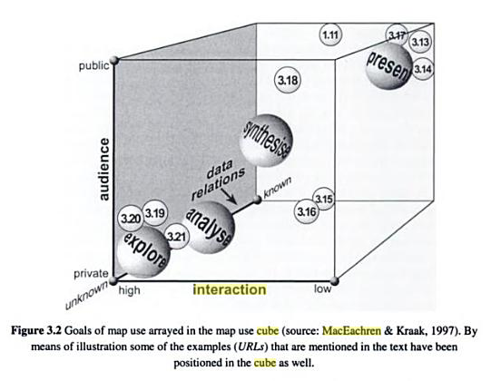

Geovisualization and Spatial Analysis
=====================================

Spatial Analysis
----------------

What is spatial analysis?
^^^^^^^^^^^^^^^^^^^^^^^^^

**From Data to Infomration**

* Beyond mapping
* added value
* transformations, manipulations and application of analaytical methods to * spatial data

Locational Invariance
^^^^^^^^^^^^^^^^^^^^^

**How insights change with location**

* spatial anlaysis is *not* locationally invariant
* the results change when the locations of the study object change
* *where* matters

Income distributions 1929

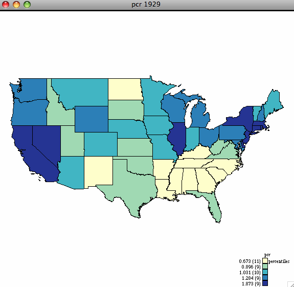

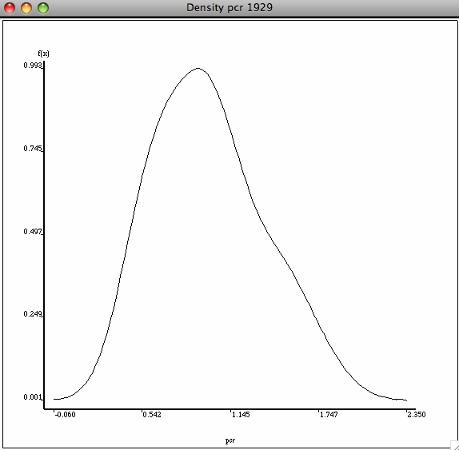

Random income distributions

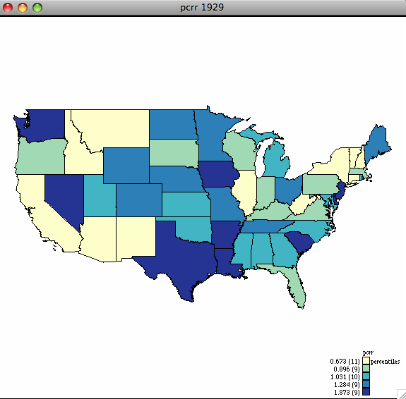

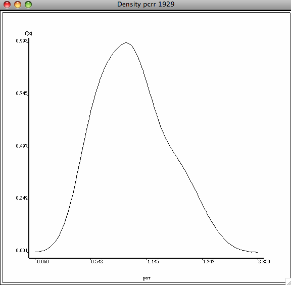

So the density is locationally invariant, while the map changes.

**Spatial Autocorrelation**

.. image:: figures/visualization/moran29.png

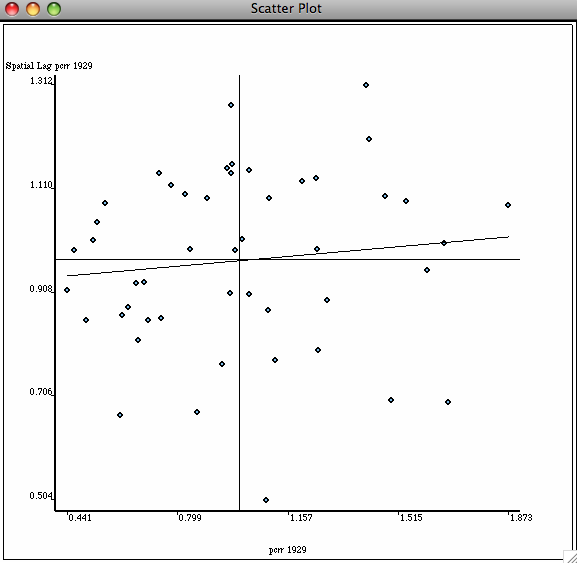

and, the Moran scatterplot is locationally variant as it changes its depiction
as the locations of the attribute values change on the map.

Components of Spatial Analysis
------------------------------

* Mapping and Geovisualization

	* **showing** interesting patterns

* Exploratory Spatial Data Analysis
	
	* **discovering** interesting patterns

* Spatial Modeling

	* **explaining** interesting patterns

EDA and ESDA
============

Exploratory Data Analysis (EDA)
-------------------------------

What is EDA?
^^^^^^^^^^^^

**Philosophy**: EDA is an approach, not simply a set of techniques, but an
attitude/philosophy about how a data analysis should be carried out.

We postpone the usual assumptions about what kind of model the data follow.

**Origins**: Tukey, J. (1977) ``Exploratory Data Analysis``. Addison Wesely.

Components
^^^^^^^^^^

**Set of techniques to:**

* maximize insight into a data set
* uncover the underlying structures
* extract important variables
* detect outliers and anomalies
* test underlying assumptions
* suggest hypotheses
* develop parsimonious models

EDA Techniques
^^^^^^^^^^^^^^

**Statistical Graphics**

* EDA relies heavily on statistical graphics
* EDA is not identical to statistical graphics
* Graphics support pattern recognition and open-minded exploration
* Interactive graphics push this much further

**Quantitative Methods**

Although heavily graphic in orientation, there are also a number of numerical
techniques in EDA

EDA Versus Confirmatory Analysis
^^^^^^^^^^^^^^^^^^^^^^^^^^^^^^^^

**Confirmatory Analysis (e.g., regression and econometrics)**

.. math::

	Problem \rightarrow Theory \rightarrow Model \rightarrow Data \rightarrow Conclusion

**Exploratory Analysis**

.. math::

	Problem \rightarrow Data \rightarrow Analysis \rightarrow Model

Exploratory Spatial Data Analysis (ESDA)
========================================

What is ESDA?
-------------

Definition
^^^^^^^^^^

* Type of EDA
* Extend to include spatial attributes of the data

Crossfertilization
^^^^^^^^^^^^^^^^^^

* Applying classic EDA to spatial data
* Development new EDA methods for spatial data
* Interactions between EDA and ESDA

How does ESDA fit in spatial analysis?
--------------------------------------

Spatial Modeling?
^^^^^^^^^^^^^^^^^

* Modeling based on assumptions
* ESDA largely model free
* Matter of degree (e.g., clustering)

Mapping?
^^^^^^^^

* Maps play a critical role in ESDA
* Does a map == ESDA?
* No. ESDA=map+manipulation+visualization

Geovisualization
================

Beyond Mapping
--------------

* Combining map and scientific visualization methods
* Exploit human pattern recognition capabilities

Statistical Maps
----------------

* innovative map devices

Mapping Issues
--------------

How to lie with maps
^^^^^^^^^^^^^^^^^^^^

* Monmonnier (1996)
* many design issues
* projects
* human perception can be tricked

Visual Analytics
----------------

The Science of Analytical Reasoning Facilitated by Interactive Visual Interfaces
^^^^^^^^^^^^^^^^^^^^^^^^^^^^^^^^^^^^^^^^^^^^^^^^^^^^^^^^^^^^^^^^^^^^^^^^^^^^^^^^

* National Visualization and Analytics Center (NVAC) 2005
* science of analytical reasoning
* visual representation and interaction
* data representation and transformations
* production, presentation and dissemination

Visual Analysis
^^^^^^^^^^^^^^^

**Tools**

* syntesize information
* derive insights
* detect the **expected** and discover the **unexpected**
* understandable assessments
* communicate effectively
* focused on policy actions

Visual Explanations
^^^^^^^^^^^^^^^^^^^

**Tufte (1997)**

Reasoning about Evidence and Design of graphics

* documenting sources (metadata)
* appropriate comparisons
* quantify and show cause and effect
* multivariate nature of analytic problems
* evaluate alterantive explanations

Choropleth Map
^^^^^^^^^^^^^^
Map Counterpart of Histogram

* values for discrete spatial uits
* choro from  choros (region) NOT chloro

Discrete Approximations

* intervals
* continuous shading

**Map Design Issues**

Choice of Intervals

* cut points: equal interval, natural breaks
* statistical criteria: equal area (quantile)

Choice of Colors

* important for perception of pattern
* function of measurement scale and variable type

**Income Quintiles**

Outlier Map
^^^^^^^^^^^

**Box Map**

* Special Quartile Map
* Outliers Highighlited

	* same  criteria as a box plot
	* outliers added as extra categories
	* six instead of four categories

* Both Magnitude and Location

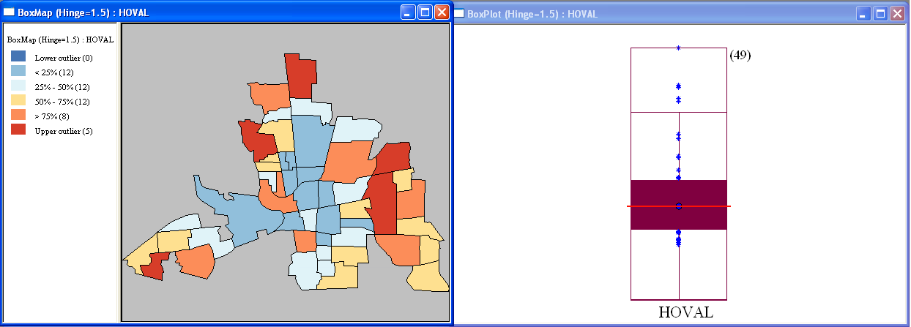

Special Maps
------------

* Cartogram
* Conditional Maps
* Map Animation

Cartogram
^^^^^^^^^

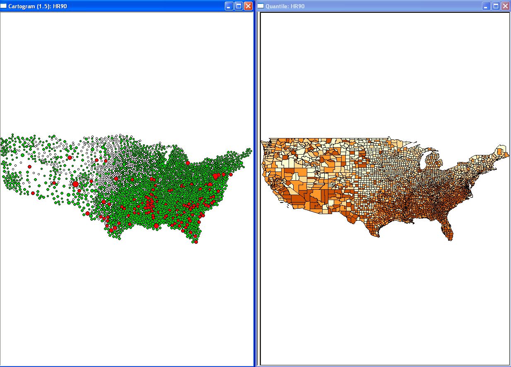

* correct for misleading effect of area

	* larger area units draw attention
	* change layout to reflect size other than area

* respect topology

Conditional Maps: Univariate Conditioning
^^^^^^^^^^^^^^^^^^^^^^^^^^^^^^^^^^^^^^^^^

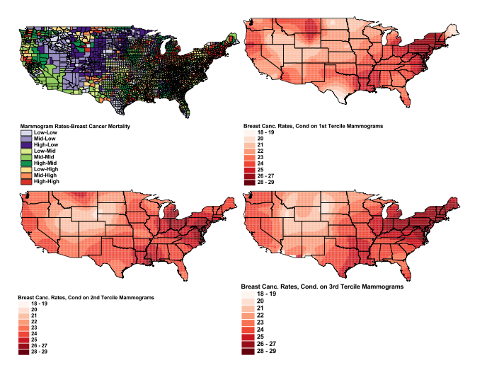

Conditional Maps: Biivariate Conditioning
^^^^^^^^^^^^^^^^^^^^^^^^^^^^^^^^^^^^^^^^^

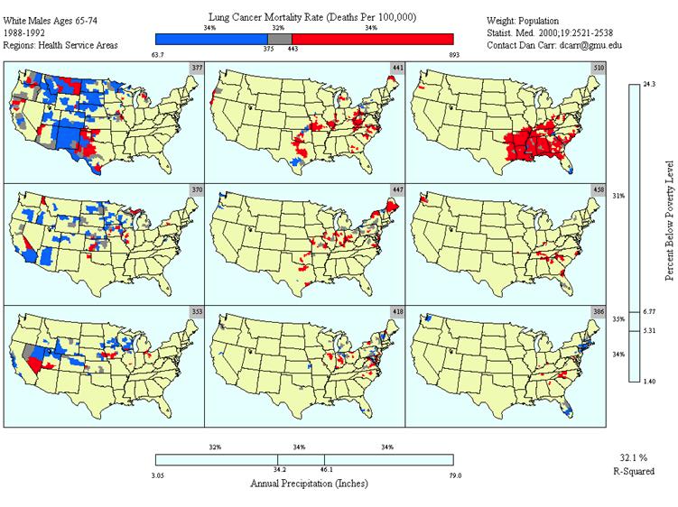

Map Animation
^^^^^^^^^^^^^

**Map Movie**

* location highlighted in turn
* from low value to high value

**Looking for pattern**

* spatial heterogeneity
* systematic movements/locations

**Animation demo**

Interactive Graphics
====================

Interactive View Manipulation
-----------------------------
* the analyst interacts with the data
* dynamic graphics
* no longer passive

Linking and Brushing
--------------------

Linking
^^^^^^^
* selection in one graph is simultaneously selected in all graphs

**Linking**

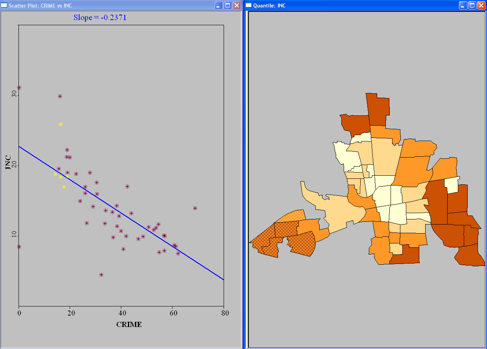

Brushing
^^^^^^^^

* changing the selection set dynamically updates all graphs

**Brusing a scatter plot**

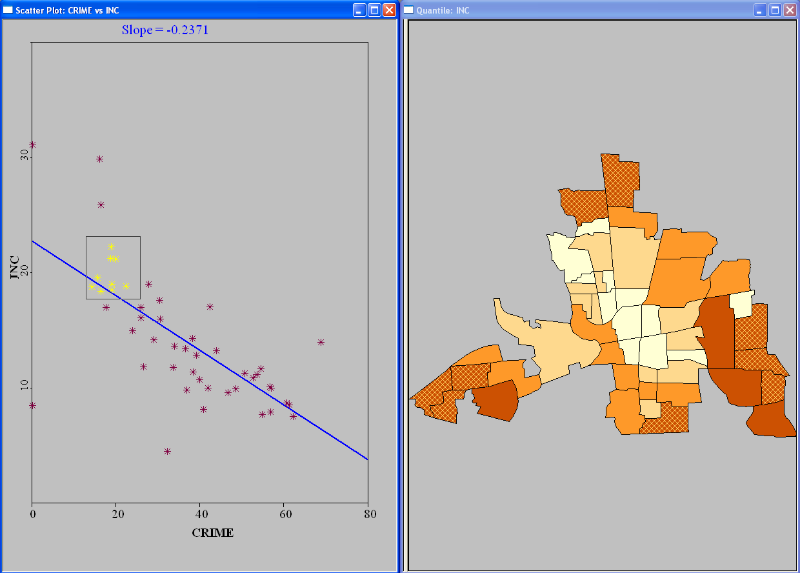

**Brushing a Parallel Coordinate Plot**

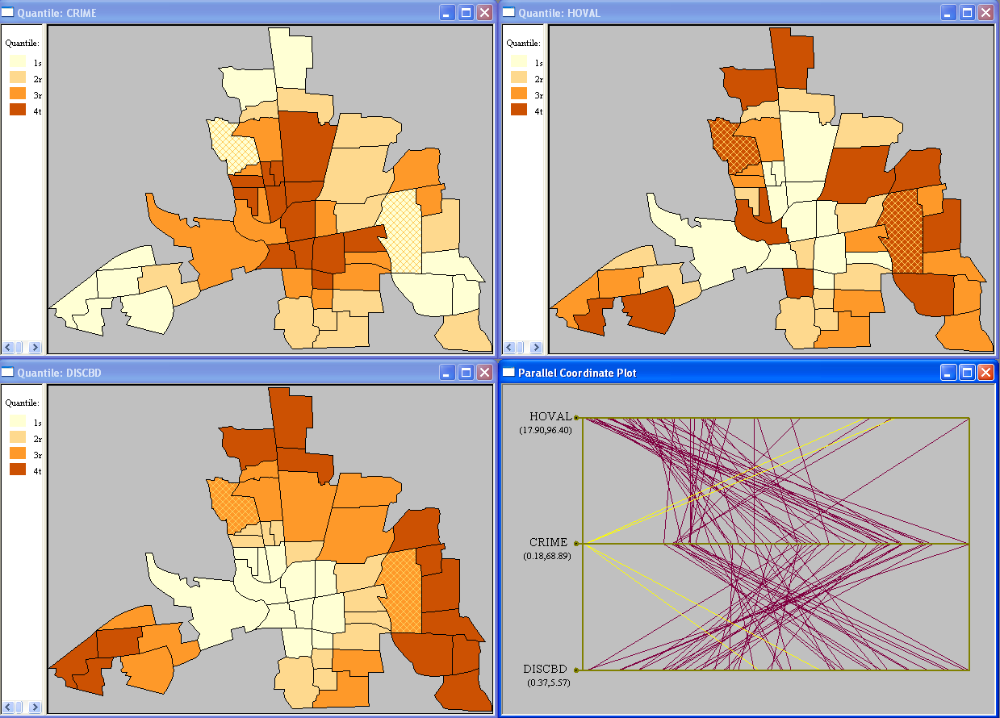

**Brushing in 3-D**

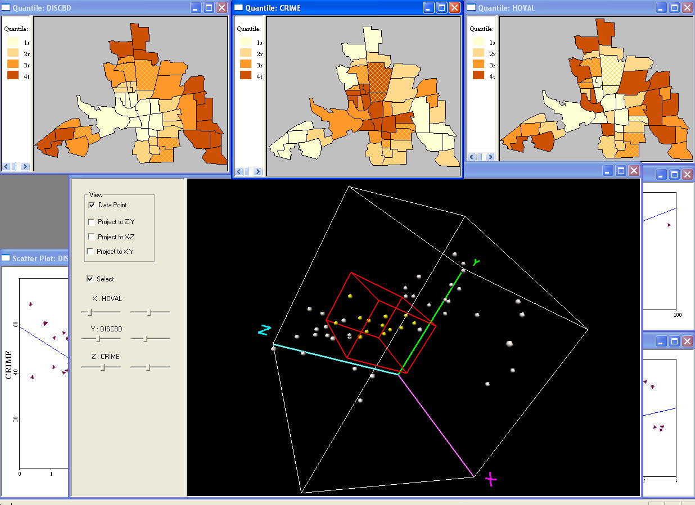
