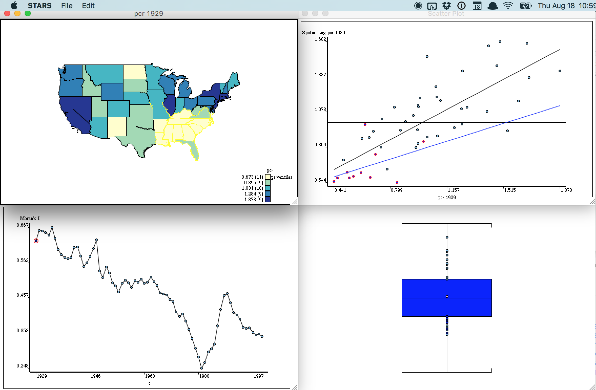
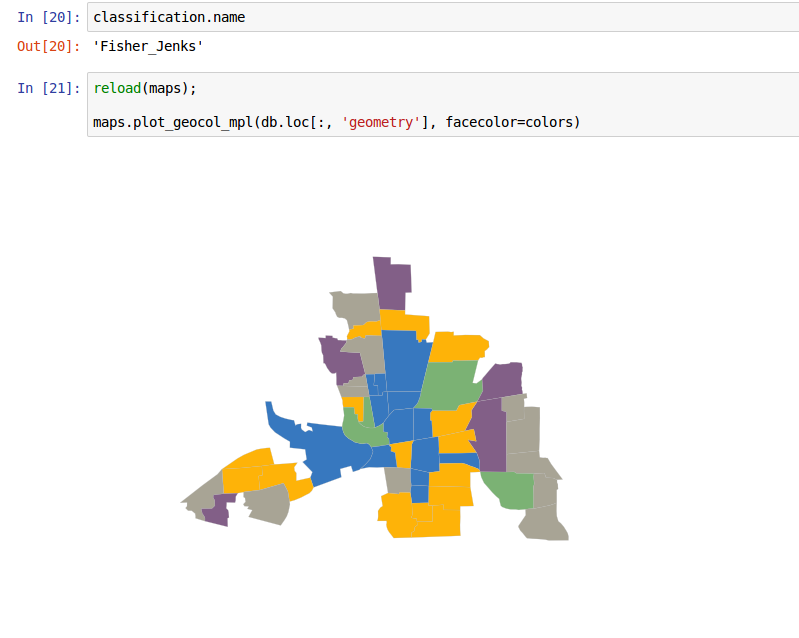
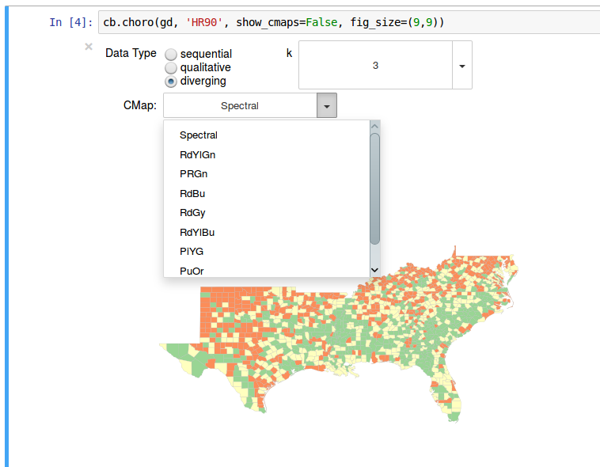
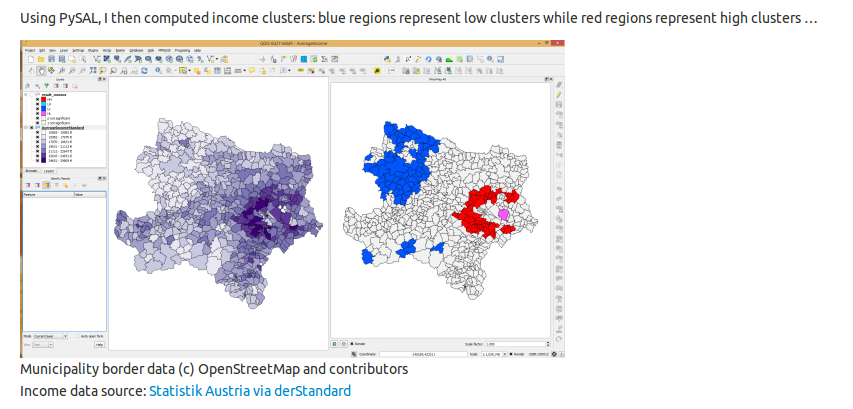
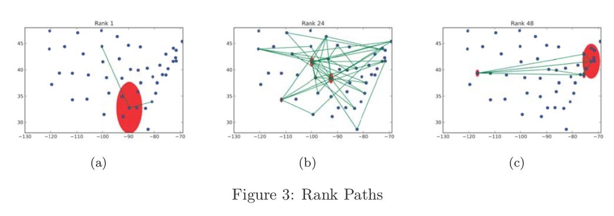

# Potential Projects

Your course project will be required to extend one of the development efforts in geovisualization currently underway in various research projects at ASU. This document is intended to provide a brief overview of the projects. Details on each project regarding how you may enhance and further the develop the effort to form you course project will be discussed in our class meetings.

In addition to the discussion of the projects provided in class, 
you are encouraged to explore the code repositories listed for each project
and to review any development discussions that are happening on the project's
issue tracker or in pull requests submitted to the project.

You will have to select your project by class meeting time on 9.1. These are
individual projects so the first student to submit a pull request indicating
their interest in claiming the project will be assigned as such. To indicate
your interest in a project, enter your name next to the **Student**: field
below the project and submit a pull request with that change.

---

## STARS version 2

[Repository](https://github.com/sjsrey/stars)

**Student**:

---

## PySAL Visualization Module: Core Infrastructure

[Repository](https://github.com/pysal/pysal/pull/844)

### Possible Extensions
- legend
- projections
- other types of maps

**Student**:

---

## PySAL Visualization Module: ChoroBrewer

[Repository](https://github.com/sjsrey/pysal/tree/choroBrewer/pysal/contrib/viz)

### Possible Extensions
- legend
- classifiers
- projections

**Student**: 

---

## QGIS+PySAL Integration

[Repository](https://github.com/weikang9009/processing_pysal/tree/integrate)

### Possible Extensions
- streamline visualization 
- extend to other types of PySAL spatial analytics

**Student**: 

---

## Rank Path Visualization

NSF related project

**Student**:

---
